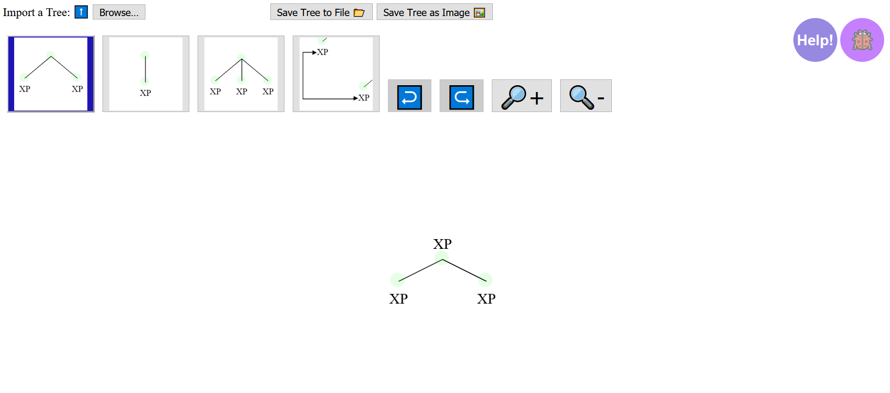

# TreeBuilder

TreeBuilder is a web interface to quickly and easily draw syntactic trees. The trees can be exported as images or files, and reloaded into the interface as needed.

TreeBuilder was created for professional linguists & linguistic students alike. Its purpose is to make tree-drawing easy and intuitive.

Please understand that this software is **a work in progress**, and as such bugs are still to be expected. A dedicated button for bug reports can be found on the interface, and your help in identifying them is really appreciated!

The current version of TreeBuilder can be found [right here!](https://nifty-morse-4f2438.netlify.app/)

The tutorial can be accessed through the interface, or [directly here.](https://nifty-morse-4f2438.netlify.app/tutorial.html)
